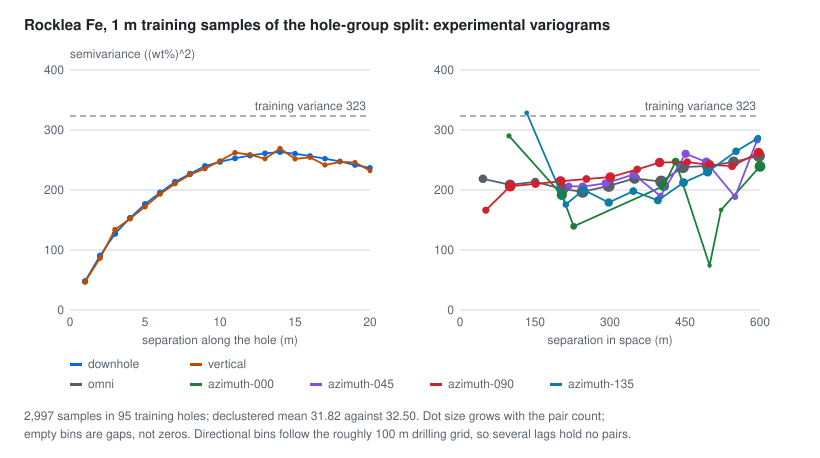

# The staged precompute pipeline

Sondara's offline lane is a chain of ten named stages, run by path with
`python data-pipeline/run.py <stage> [options]` in the local `.venv-pipeline`. Every stage reads the previous stage's
outputs, writes its own with a hash, and never reaches back to a source it did not declare. Raw sources stay outside
the repository (`--cache`, default `$SONDARA_RAW`, else `build/sources`); derived outputs go to `build/derived/`
(gitignored) until the export stage produces the compact artifacts the web page reads.

| # | Stage | Does | Status |
|---|---|---|---|
| 1 | `acquire` | Fetches the allowlisted sources of `data/sources/manifest.json` over HTTPS with byte bounds and SHA-256 checks, or copies a bundled licensed subset; writes an acquisition receipt | 0.03.000 |
| 2 | `ingest` | Builds each family's canonical project: source namespaces, collars, surveys, trajectories, analytes, supports, determinations, geology, the QA issue table and the reconciliation waterfall, every row carrying its raw source row identity; with `--manifest`, imports user files as a transaction ([guide](../guides/02_bring-your-own-data.md)) | 0.03.000 (Rocklea, Alberta, NTGS); 0.06.000 (user imports) |
| 3 | `preprocess` | Exact desurvey, support positions, compositing, the log overlay and the modeling populations, through GeoCond | 0.04.000 (Rocklea, Alberta, NTGS) |
| 4 | `dataset` | Frozen hole-group, spatial-margin and declared train, validation, calibration and test assignments; every derivative stays with its hole | 0.07.000 |
| 5 | `features` | Training-only statistics, cell declustering, downhole, directional and cross experimental variograms, declared orientations | 0.07.000 |
| 6 | `train` | Covariance candidates selected on validation, residual covariance for universal kriging, LMC, indicator covariances and normal scores; the learned models come with SD-7 | 0.08.000 (classical) |
| 7 | `infer` | NN, IDW, SK, OK, UK, LMC cokriging, MIK and SGS on identical test targets; SNESIM, Direct Sampling and the learned methods come with SD-6 and SD-7 | 0.08.000 (classical) |
| 8 | `evaluate` | Scores against the test truths, paired hole-block comparisons with OK, variance calibration on the calibration holes, MIK Brier and log scores, SGS fair CRPS, coverage, convergence and reproduction; the scenario matrix | 0.09.000 (classical) |
| 9 | `export` | Arrow and Parquet tables, typed geometry, tiled fields, the model registry, metrics and an immutable manifest | planned |
| 10 | `validate` | Source identity, every expected method, case and variant cell, masks, seeds, license attribution and offline and live parity | planned |

## The canonical project (stage 2 output)

`build/derived/<family>/project.json` follows `drillhole.project/v2`, defined normatively by
[`schemas/project.schema.json`](../../schemas/project.schema.json); `summary.json` beside it holds the project hash,
the recipe and its hash, the table counts, the waterfall and the issue counts. The source adapters and the manifest
importer write the same contract.

| Table | One row is |
|---|---|
| `frames` | a coordinate frame: kind (`projected-metric` or `local-metric`), unit, EPSG code or a written definition, vertical datum, the anchor of a local frame, stated assumptions |
| `collars` | a hole: namespace and source identifier, frame, x, y, z, total depth (null when the source gives none), observed depth, recorded orientation with its azimuth reference and any source inclination |
| `surveys` | a survey record: depth, azimuth, dip, azimuth reference, instrument and role (`recorded-collar-direction`, `measured`, `compiled-extension`) |
| `trajectories` | how a hole's path is known (`measured-stations`, `collar-orientation`, `assumed-vertical`) and its declared start and end extensions (`none` or `tangent`) |
| `analytes` | an analyte with its unit, the quantity it reports and its source column |
| `supports` | one physical sample: `interval` (known uniform length), `sampling-envelope` (unknown weights), `point` or `unknown`, with its sample identifier |
| `determinations` | one result: value, the raw source token, state (`measured`, `censored-below`, `censored-above`, `missing`, `not-sampled`, `lost-core`, `sentinel`), qualifier, detection limit, method, lab, and whether it is an original, a repeat or a duplicate |
| `geology` | a logged interval or an event, with every source code kept verbatim under its source column name |
| `qc` | a control sample (standard or blank) and its results, with no hole and no coordinates |
| `exclusions` | a record kept in the project but excluded from modeling, with the finding that excluded it |
| `issues` | a QA finding: code, severity, the affected rows, what it means and the action taken |
| `waterfall` | one reconciliation step and its count |

`scripts/check_artifacts.py` validates the schema and then the rules a schema cannot state: unique identifiers, every
record on a known collar, one trajectory per collar, support geometry consistent with its kind, determination states
(a measured value with `=`, censoring as a qualifier with a positive limit and no value, any other state with
neither), controls without supports, geology intervals and events, exclusions that name existing records, and a
summary whose hash and counts match the project. The tests prove it rejects each of those corruptions.

## The preprocessed output (stage 3)

`build/derived/<family>/preprocessed.json` follows `drillhole.preprocessed/v1`. It names the project it was built from
by hash, the recipe and its hash, and the GeoCond version; `preprocess-summary.json` holds the output hash, the
waterfall and the populations without their members. The stage refuses a project whose hash does not match its ingest
summary. The geometry and compositing mathematics are GeoCond's
([Trajectories, supports and compositing](https://github.com/fsantibanezleal/GeoCond/blob/main/docs/methods/06_geometry_and_compositing.md));
this stage decides what goes into them.

| Part | What it holds | The policy |
|---|---|---|
| `trajectories` | per hole: stations with positions, end position at total depth, largest dogleg | minimum curvature through what the source supports: dip -90 for an assumed-vertical hole, the recorded collar direction for a collar-orientation hole, the recorded collar direction and the measured stations for a measured hole; a declared tangent extension to total depth |
| `positions` | per support: start, mid and end positions, or the point position, and whether the depth lies beyond the last station | every position on the arc; unknown supports get none |
| `selections` | per distinct interval geometry and analyte: the chosen result, its value in the analyte's unit and the rule (`single`, `reassay`, `priority`), or the reason it stays unresolved | measured original results only; a re-assay replaces an above-range result; several methods are separated only by a declared priority; repeats are never chosen and never add support |
| `eligibility` | the rule version (`eligibility-v1`), result states per analyte, selected and unresolved counts, excluded results | only selected measured values are modeled; every other state is counted |
| `composites` | per hole and length (1, 2, 5 m by default): depth range, status, coverage, valid and missing length, mid position, and per analyte the mean, numerator, observed mean and coverage, with the parents and their overlaps | selected values on known continuous intervals only; each analyte composites the geometries that carry it, on the hole's boundaries from its first selected depth; below the minimum coverage (1 by default) a composite keeps its numerator and observed mean but has no mean; the last short composite is a labelled residual; every grade-length integral is conserved per hole |
| `fragments` | per distinct interval geometry of a logged hole: the pieces cut at log boundaries, with the logs and their codes | each geometry is cut once, so repeats never multiply pieces; the pieces add up to their parent exactly |
| `overlay` | per sampling envelope: coverage and proportions by any log, by known `Litho_unit` and by known `Rock_type`; doubly logged length; conflicts | logs cut at every endpoint; two different known codes on one piece are a conflict and count as uncovered; `-9999` and blank are unknown |
| `gaps`, `repeats`, `censoring` | unsampled stretches between distinct supports; supports sampled twice; censored and numeric counts per analyte | recorded, never filled or averaged |
| `populations` | per modeling task: members, support, rule, excluded counts | only full composites form a uniform-support population; Alberta envelopes enter only the named envelope-centre approximation; a single hole forms no estimation population |

<picture>
  <source media="(prefers-color-scheme: dark)" srcset="../assets/preprocess-rocklea-composites-dark.svg">
  
</picture>

`scripts/check_artifacts.py` validates the preprocessed output against its project (input hash, trajectories,
positions, composite statuses, means only where covered, per-hole conservation, population members, overlay
coverage), and `scripts/figures/preprocess_figures.py` draws the figures of these pages from the outputs.

## Splits and features (stages 4 and 5)

`dataset.json` (`drillhole.dataset/v1`) freezes, per family, the hole assignment of each scheme and records the
membership counts and hashes of every derived table (samples, composites, fragments, repeats, populations):

| Scheme | Rule |
|---|---|
| `hole-group` | holes sorted by ID, permuted with the recorded seed (PCG64), cut 60/15/10/15 into train, validation, calibration and test by largest remainder |
| `spatial-margin` | the outermost 15 % of holes by collar distance from the centroid are test; holes within 1.5 median nearest-neighbour collar distances of a test hole are in no split; the rest cut 60/15/10 |
| `declared` | the holes a manifest names (`holdout`) are test; the rest cut 60/15/10 |

A family with fewer holes than splits has no split and says so (NTGS). `features.json` (`drillhole.features/v1`) holds,
per scheme, population and analyte, the statistics and variograms of the training members only:

| Part | Content |
|---|---|
| `statistics` | count, holes, mean, variance, extremes, and the cell-declustered mean with its cell (the median collar spacing of the training holes horizontally, the support length vertically) and four diagonal origin offsets |
| `variograms` | downhole (pairs within one hole, lag = support length), omnidirectional, four horizontal directions (22.5 degree tolerance, bandwidth twice the collar spacing) and vertical, each with edges, mean separations, pair counts, semivariances, the pair population and the sampling seed |
| `cross` | downhole and omnidirectional cross variograms on co-located values of the declared variable sets |
| `orientation` | when a manifest declares orientations: the principal plane of their normals, or `undefined` when the two largest eigenvalues of the orientation tensor are within a ratio of 1.2 |

<picture>
  <source media="(prefers-color-scheme: dark)" srcset="../assets/features-rocklea-variograms-dark.svg">
  
</picture>

## Models and predictions (stages 6 and 7)

`models.json` (`drillhole.models/v1`) holds, per scheme and population, every candidate covariance and the one chosen:

| Part | Rule |
|---|---|
| candidates | spherical and exponential isotropic fits on the omnidirectional variogram; spherical, exponential and nested spherical anisotropic fits on the four horizontal and the vertical variograms in frames at azimuths 0, 45, 90 and 135 degrees; 14 in all, each with its fit objective, the range bound it may reach, and its validation RMSE and coverage |
| selection | the lowest validation RMSE of ordinary kriging among candidates that estimate at least 90 % of the validation targets; test values are never read |
| universal kriging | a training-only linear trend in x, y and z and the covariance fitted to its residuals |
| LMC | a joint isotropic fit of the declared variables' direct and cross variograms, every sill matrix positive semidefinite by construction |
| MIK | indicator covariances at the training-weighted deciles (cell declustering); a threshold whose fit fails is recorded |
| SGS | a weighted normal-score table of the training values, and a Gaussian-space covariance chosen among twelve anisotropic candidates (four frames, three family sets) fitted on the normal scores' horizontal and vertical variograms, by the validation RMSE of simple kriging of the normal scores |
| structure | the residual, LMC and indicator covariances are fitted with the families and frame selected for OK, on the horizontal and vertical variograms of their own values |

`predictions.json` (`drillhole.predictions/v1`) holds, per scheme and population, every method's row for every test
target: status (estimated, uninformed, failed, prior-only), reason, mean, variance, and the samples, holes and largest
per-hole count behind it (probabilities for MIK, the ensemble mean and quantiles for SGS). All methods condition on the
training rows only, with one neighbourhood plan: 4 to 24 samples, at most 6 from one hole. Universal kriging whose
drift is rank deficient in that neighbourhood is retried once with 48 samples and marked, never replaced by ordinary
kriging; SGS searches the data (the same plan, at most 6 per hole) and 12 previously simulated nodes apart, GeoCond
0.7.0's two-part search, so the dense nodes of a held-out hole cannot crowd the other holes out.

## Metrics and the scenario matrix (stage 8)

`metrics.json` (`drillhole.metrics/v1`) holds, per scheme and population, every method's scores on its own and on the
common targets, the paired comparison with OK, the calibration, MIK and SGS scores, the scenario variants and a
receipt with the seeds, plan, engine versions and hashes. `scenarios.json` (`drillhole.scenarios/v1`) resolves the 32
registered scenarios cell by cell. Both are checked by `scripts/check_artifacts.py`, and the definitions, results and
limits are on [the model-evaluation page](06_model-evaluation.md).

## Determinism

The adapters raise on any drift from the pinned counts, and ingesting the same sources twice produces the same project
hash. The recipe text and its hash travel with every project, so a later result names the exact rules that built its
inputs.
