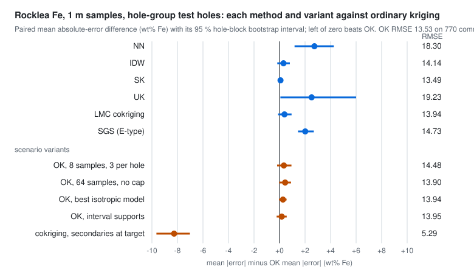
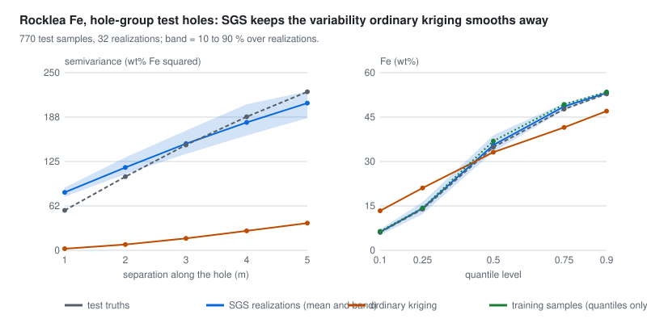

# Model evaluation (stage 8)

`stages/evaluate.py` scores every method against the values of held-out holes, and `stages/scenarios.py` turns those
scores into the scenario matrix. Truth values are read here and nowhere earlier: the dataset stage froze the splits,
the features and train stages saw training rows (and validation rows only to choose models), and the infer stage
predicted the calibration and test rows without their values. Output: `metrics.json` (`drillhole.metrics/v1`) per
family and `scenarios.json` (`drillhole.scenarios/v1`) for the product. The design and its requirements (R-540 to
R-548) are in [the classical-estimation design](../design/features/classical-estimation/design.md).

## The prediction tasks

| Scheme | Test holes | What it asks |
|---|---|---|
| `hole-group` | 15 % of the holes, drawn with seed 20260926; 23 Rocklea holes, 3 Alberta holes | predict an undrilled hole inside the drilled area |
| `spatial-margin` | the outermost 15 % by collar distance, with a buffer of 1.5 collar spacings kept out of training; 24 Rocklea holes, 3 Alberta holes | predict beyond the drilled area, where the local mean can differ |

Every method predicts the same targets from the same training rows and neighbourhood plan (4 to 24 samples, at most
6 from one hole). A test hole is predicted whole, so a method never borrows samples from the hole it predicts.

## What is measured

| Measure | Definition | Why |
|---|---|---|
| Scores | bias, MAE, RMSE, the 50 % and 90 % absolute-error quantiles, length-weighted scores, and the hole-macro RMSE (the mean of per-hole RMSEs), in native units, on each method's own targets and on the common targets every continuous method predicted | a method that declines hard targets must not look better by declining them; one long hole must not dominate |
| Paired comparison | the mean absolute-error difference with OK on the targets both predicted, with a 95 % interval from 1000 bootstrap draws of holes (seed 20260926) | errors along one hole are correlated, so resampling samples would overstate the evidence |
| Variance calibration | a scale from the calibration holes' z-scores, applied to the test rows | the kriging variance is conditional on the fitted covariance; it is checked, not believed |
| MIK | Brier and log scores per threshold against the constant training proportion | a probability must beat the climatology |
| SGS | fair CRPS, 80 % interval coverage, convergence at 8, 16 and 32 realizations, and the reproduction of the truths' histogram and downhole variogram | simulation is for variability; its E-type is not its purpose |
| Training range | estimates outside the training minimum and maximum | extrapolation is reported, not hidden |

**Variance calibration.** With $z_i = (\hat{y}_i - y_i)/\sigma_i$ on the calibration holes, the scale is
$s = \overline{z^2}$, and the test z-scores are divided by $\sqrt{s}$. A scale near one says the kriging variances are
right in size; the 95 % coverage is read before and after. The scale uses the calibration holes only; changing a test
truth does not change it (R-542).

**Fair CRPS.** For an ensemble $x_1, \dots, x_m$ and a truth $y$,

$$\mathrm{CRPS}_{\text{fair}} = \frac{1}{m}\sum_{i=1}^{m}|x_i - y| \;-\; \frac{1}{2m(m-1)}\sum_{i=1}^{m}\sum_{j=1}^{m}|x_i - x_j|,$$

which is unbiased for the CRPS of the distribution the members sample. The plain ensemble CRPS, with $2m^2$ in the
second denominator, overstates it by $\mathrm{E}|X - X'|/(2m)$ and would penalize a small ensemble for its size; the
test checks that the fair form recovers the CRPS of $N(0, 1)$ at 0, $2\varphi(0) - 1/\sqrt{\pi} \approx 0.2337$, from
four-member ensembles (R-544).

**Brier score and skill.** For a threshold $t$ with forecast $p_i = \hat{F}(t)$ and outcome $o_i = 1[y_i \le t]$,
$\mathrm{BS} = \overline{(p_i - o_i)^2}$, and the skill is $1 - \mathrm{BS}/\mathrm{BS}_{\text{ref}}$ with the constant
training proportion as the reference. Log scores clip probabilities to $[10^{-3}, 1 - 10^{-3}]$, recorded.

## Rocklea Dome, Fe, hole-group split

770 one-metre test samples in 23 holes; every method predicted every one.

| Method | RMSE (wt% Fe) | MAE | Bias | Hole-macro RMSE | MAE minus OK's, 95 % hole-block interval | Outside the training range |
|---|---:|---:|---:|---:|---|---:|
| NN | 18.30 | 13.19 | -1.43 | 17.48 | +2.73 [+1.17, +4.25] | 0 |
| IDW | 14.14 | 10.77 | +0.39 | 13.75 | +0.31 [-0.18, +0.81] | 0 |
| SK | 13.49 | 10.54 | +0.20 | 13.15 | +0.08 [+0.01, +0.15] | 0 |
| OK | 13.53 | 10.46 | -0.05 | 13.18 | reference | 0 |
| UK | 19.23 | 12.98 | -3.86 | 16.65 | +2.52 [+0.07, +6.00] | 77 |
| LMC cokriging | 13.94 | 10.84 | -0.94 | 13.43 | +0.38 [-0.11, +0.94] | 2 |
| SGS (E-type) | 14.73 | 12.47 | +0.36 | 14.84 | +2.01 [+1.45, +2.68] | 0 |

<picture>
  <source media="(prefers-color-scheme: dark)" srcset="../assets/evaluate-rocklea-methods-dark.svg">
  
</picture>

- **The kriging family ties.** SK and OK differ by 0.08 wt% of MAE; LMC cokriging with SiO2 and Al2O3 does not improve
  on OK when the secondaries come only from the training holes (+0.38, interval across zero). IDW's MAE is 0.31 wt%
  above OK's, with an interval across zero. Only NN is clearly worse among the interpolators. The selected model puts
  158 of 324 wt% squared in the nugget and its horizontal ranges at the fitting bound: on a 100 m grid, the continuity
  between holes is not resolved, and the methods converge on a neighbourhood mean.
- **UK extrapolates.** A local linear drift in x, y and z, fitted in each neighbourhood, carries the trend beyond
  the data: 77 estimates fall outside the training range and the bias is -3.86. It needed the declared enlarged
  neighbourhood for 39 targets whose neighbourhoods lay in one vertical plane (19 at 2 m).
- **The variances are right in size inside the drilled area.** Every kriging variance scale is within 8 % of one, and
  95 % coverage is 0.94 to 0.95 before and after calibration.
- **MIK beats the climatology at every decile**, with Brier skill 0.13, 0.19, 0.27, 0.30, 0.37, 0.33, 0.28, 0.20 and
  0.09 from the first to the ninth: most in the middle of the distribution, least in the tails.

**Support (R04).** Longer composites average out short-scale variation, and every method's RMSE falls with support:

| Support | Test targets | NN | IDW | SK | OK | UK | LMC | SGS E-type |
|---|---:|---:|---:|---:|---:|---:|---:|---:|
| 1 m | 770 | 18.30 | 14.14 | 13.49 | 13.53 | 19.23 | 13.94 | 14.73 |
| 2 m | 378 | 17.10 | 13.92 | 12.76 | 12.79 | 14.46 | 12.71 | 13.56 |
| 5 m | 146 | 14.18 | 12.90 | 11.30 | 11.34 | 11.09 | 10.89 | 11.40 |

**Scenario variants (R05, R06, R07, R09),** all against OK on the same 770 targets:

| Variant | Scenario | RMSE (wt% Fe) | MAE minus OK's, 95 % interval | Mean shift from OK |
|---|---|---:|---|---:|
| OK with 8 samples, at most 3 per hole | R06 | 14.48 | +0.34 [-0.19, +0.93] | -0.29 |
| OK with 64 samples, no per-hole cap | R06 | 13.90 | +0.44 [-0.03, +0.90] | +0.44 |
| OK with the best isotropic candidate (exponential) | R05 | 13.94 | +0.27 [-0.04, +0.55] | +0.30 |
| OK with observations and targets integrated over their 1 m intervals (4-point Gauss-Legendre) | R07 | 13.95 | +0.17 [-0.23, +0.56] | -0.62 |
| Cokriging with the secondaries measured on the test samples | R09 | 5.29 | -8.26 [-9.65, -7.02] | +0.34 |

The neighbourhood, the anisotropy and the support integration each move the answer by less than the hole-block
interval: on this grid the evidence cannot separate them. The sparse-primary variant is the exception, and it is not
spatial evidence: Fe, SiO2 and Al2O3 are major components of the same sample, whose analysed oxides sum to nearly
100 %, so knowing SiO2 and Al2O3 at the target nearly determines Fe. It answers "does a co-located secondary
inform a missing primary", not "does continuity carry between holes".

## Rocklea Dome, Fe, spatial margin

527 one-metre test samples in 24 margin holes, whose Fe mean (20.47 wt%) is 13 wt% below the training mean (33.56).

| Method | RMSE (wt% Fe) | MAE | Bias | Hole-macro RMSE | MAE minus OK's, 95 % hole-block interval | Outside the training range |
|---|---:|---:|---:|---:|---|---:|
| NN | 20.95 | 15.79 | -4.62 | 19.64 | +2.22 [+1.63, +2.78] | 0 |
| IDW | 17.39 | 13.46 | -2.63 | 15.66 | -0.12 [-0.56, +0.33] | 0 |
| SK | 17.17 | 15.23 | +6.59 | 17.09 | +1.66 [+0.09, +3.36] | 0 |
| OK | 17.48 | 13.58 | -2.80 | 15.74 | reference | 0 |
| UK | 581.31 | 289.72 | +185.85 | 239.17 | +276.14 [+100.73, +456.10] | 340 |
| LMC cokriging | 17.25 | 13.88 | -2.11 | 16.02 | +0.31 [-0.49, +1.14] | 0 |
| SGS (E-type) | 18.08 | 16.07 | +8.89 | 18.29 | +2.49 [+0.39, +4.85] | 0 |

- **A stationary mean is wrong at the margin.** SK and SGS krige around the declustered training mean, so far from the
  data they return toward 33 wt% where the truth is near 20: biases of +6.59 and +8.89. OK re-estimates the mean in
  each neighbourhood and is biased by -2.80.
- **UK diverges.** 340 of 527 estimates leave the training range (up to hundreds of wt%): a linear drift fitted to
  interior neighbourhoods is extrapolated tens to hundreds of metres. The same happens at 2 m (RMSE 307) and 5 m (53).
  This is the method doing what it is told, and the reason a drift model needs a physical basis before it is used
  beyond the data.
- **Calibration does not transfer.** The scales estimated on interior calibration holes (0.77 for OK) shrink the
  margin intervals, and OK's 95 % coverage falls from 0.95 to 0.92: a variance calibrated inside the drilled area is
  not valid outside it.

| Support | Test targets | NN | IDW | SK | OK | UK | LMC | SGS E-type |
|---|---:|---:|---:|---:|---:|---:|---:|---:|
| 1 m | 527 | 20.95 | 17.39 | 17.17 | 17.48 | 581.31 | 17.25 | 18.08 |
| 2 m | 256 | 19.49 | 14.93 | 17.10 | 15.74 | 307.19 | 16.43 | 15.89 |
| 5 m | 95 | 15.95 | 13.82 | 15.48 | 14.67 | 52.53 | 13.61 | 14.39 |

## Sequential Gaussian simulation

<picture>
  <source media="(prefers-color-scheme: dark)" srcset="../assets/evaluate-rocklea-sgs-dark.svg">
  
</picture>

On the hole-group test holes, OK's estimates have half the variance of the truths (154.9 against 310.6 wt% squared)
and almost no variation along a hole (a downhole semivariance of 2.2 at 1 m against 56.2): kriging is a conditional
mean and smooths. The realizations keep the variance (318.3) and the quantiles (6.20, 35.57 and 53.16 at 10, 50 and
90 %, against 6.05, 34.87 and 52.82), and their downhole variogram meets the truths' from 3 m on:

| Separation (m) | Pairs | Truths | OK | SGS mean | SGS 10 to 90 % |
|---:|---:|---:|---:|---:|---|
| 1 | 744 | 56.2 | 2.2 | 81.5 | 75.5 to 88.2 |
| 2 | 723 | 103.7 | 8.1 | 116.6 | 107.1 to 130.9 |
| 3 | 700 | 148.3 | 16.8 | 150.1 | 135.7 to 168.5 |
| 4 | 677 | 188.0 | 27.3 | 180.0 | 161.6 to 205.6 |
| 5 | 654 | 223.1 | 38.3 | 207.1 | 186.0 to 223.6 |

At 1 and 2 m the realizations are rougher than the truths. The selected Gaussian-space model has a nugget of 0.10,
a first spherical structure (sill 0.55) with a vertical range of 9.6 m and horizontal ranges of 6 m, and a second
(sill 0.21) with horizontal ranges of 1,180 and 1,913 m at azimuth 90: the short vertical structure is there, but the
nugget adds roughness the truths do not have, and most of the variance is uncorrelated between holes.

| Realizations | E-type RMSE (wt% Fe) | Fair CRPS | 80 % coverage |
|---:|---:|---:|---:|
| 8 | 15.00 | 7.50 | 0.72 |
| 16 | 14.75 | 7.72 | 0.80 |
| 32 | 14.73 | 7.88 | 0.82 |

The E-type settles by 16 realizations. The 80 % coverage rises from 0.72 at 8 realizations to 0.80 at 16 and 0.82
at 32: the 10 and 90 % quantiles of 8 draws are too narrow. On the spatial margin the coverage is 0.71 and the fair CRPS 10.07, for the
stationary-mean reason above.

**How this check found two defects.** The first evaluation showed realizations with a downhole semivariance of 223 at
1 m against 56 for the truths. The Gaussian-space covariance had been fitted isotropically on lags of half the
collar spacing, where no pair lies within a hole, so the vertical continuity went to the nugget. Fitting it with
ordinary kriging's structure (one exponential, anisotropic) restored the vertical continuity but cut the correlation
between holes (E-type RMSE 17.7). The covariance is now selected on its own among twelve anisotropic candidates by the
validation error of simple kriging of the normal scores (R-534). With that model, a single search of 24 let the
simulated nodes of a hole crowd the training holes out, and GeoCond 0.7.0's two-part search (24 data at most 6 per
hole, 12 nodes, after GSLIB's `ndmax` and `ncnode`) lowered the E-type RMSE on the test holes by about 1.3 wt% (R-535).
The experiments are recorded in the management repository.

## Alberta MAR_19860002, Cu at the envelope centres

Three test holes per scheme (28 and 26 envelope centres), so the hole-block intervals are wide and the results are
weak evidence.

| Method | Hole-group RMSE (ppm Cu) | MAE minus OK's | Spatial-margin RMSE | MAE minus OK's |
|---|---:|---|---:|---|
| NN | 5.87 | +0.10 [-0.64, +1.42] | 12.15 | +1.01 [+0.00, +1.83] |
| IDW | 5.60 | -0.50 [-1.18, +0.46] | 10.50 | +0.21 [-0.09, +0.64] |
| SK | 5.76 | -0.05 [-0.53, +0.46] | 11.19 | +0.05 [-0.00, +0.08] |
| OK | 5.47 | reference | 11.15 | reference |
| UK | 7.33 | +0.39 [-0.18, +1.20] | 16.21 | +4.63 [-0.47, +11.12] |
| LMC cokriging (Cu with Zn) | 6.29 | +0.78 [-1.06, +5.20] | 10.69 | +1.93 [+0.58, +2.89] |
| SGS (E-type) | 5.58 | -0.37 [-1.17, +0.76] | 11.36 | -0.04 [-0.92, +0.80] |

- No method separates from OK inside the drilled area; Zn does not help Cu (A03), consistent with the weak association
  the data dossier recorded.
- The kriging variances are too large: OK's scale is 0.19 on the hole-group split, where every test value falls
  inside the 95 % interval before calibration, and 0.31 on the margin. The scale rests on two calibration holes.
- MIK has no skill on the hole-group split (Brier skill -0.14 to -0.00) and little on the margin (-0.02 to 0.40):
  with 13 or 14 training holes, the indicator covariances are barely informative.
- The Gaussian-space model's sill is 1.87 for normal scores of unit variance, with two of its three ranges at the
  bound: the realizations have twice the truths' variance (41.3 against 21.7) and the 80 % coverage is 0.54.

## The scenario matrix

`scenarios.json` resolves each registered scenario to cells: a method or variant computed from a family's metrics
(citing them by hash), a stage output, a test that verifies an authored truth, or a pending cell naming the unit that
will compute it. The artifact check fails on a missing cell, a pending cell without an owner, or a computed cell whose
metrics changed.

| State | Scenarios |
|---|---|
| complete | R01, R04 to R09, A01, A03, A05, A06, S01 to S09 |
| partial | R02 and A02 (the exported views, SD-8), R10 and R11 (DeepKriging and KCN, SD-7), S12 (export and re-import, SD-8) |
| pending | R03 (fence section, SD-8), R12 (the spectral-index review, SD-7), A04, A07, A08, S10, S11 (categorical simulation, SD-6) |

Cells: 47 computed, 17 verified by tests, 14 pending (5 for SD-6, 5 for SD-7, 4 for SD-8), none missing.

## Receipts

Every `metrics.json` carries a receipt: the split seeds and proportions, the neighbourhood plan (including the 12
simulated nodes of SGS), the engine versions of fit, infer and evaluate (GeoCond 0.07.000, NumPy 2.5.3, SciPy 1.18.1),
the hashes of the dataset, models and predictions it read, and the hash of the scored result, so every number on
this page names the inputs and settings behind it.

## What it does not show

These are held-out comparisons on two public datasets, not a resource estimate: the test holes are drilled holes, the
supports are samples and envelope centres rather than blocks, and the classical methods here are compared under one
neighbourhood plan chosen before evaluation, not tuned per method. SNESIM, Direct Sampling and the learned methods
join the same comparison in units SD-6 and SD-7.
