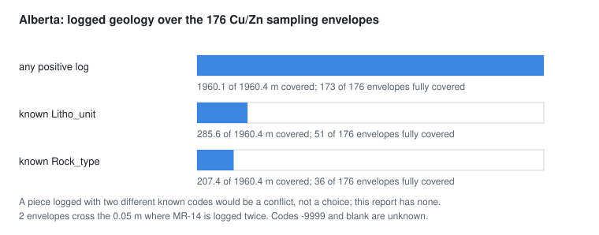

# Alberta MAR_19860002: inclined holes, logged geology, sampling envelopes

**Source.** Alberta Geological Survey, DIG 2024-0022, a compilation of drillhole data from mineral assessment reports
(`DIG_2024_0022_0.zip`, 8,623,762 bytes, SHA-256 pinned), under the Open Government Licence - Alberta with
acknowledgement of the Alberta Energy Regulator / Alberta Geological Survey. Sondara uses report `MAR_19860002`. The
archive's three tables are tab-separated Windows-1252 with multiline quoted descriptions; they are read member by member
without extraction, decoded with the declared encoding, and joined on `(Data_src, DH_name)`.

## What the ingest keeps

| Quantity | Count |
|---|---|
| Collars, with Easting, Northing, ground elevation, total depth, azimuth and dip | 22 |
| Geology records (138 intervals with positive length, 12 point events) | 150 |
| Assay rows (wide, 32 populated analyte columns) | 3,717 |
| Samples with numeric Cu and Zn | 342 |
| of which positive sampling envelopes, on all 22 holes | 176 |
| point-depth samples | 162 |
| samples without endpoints | 4 |

## Decisions carried into every result

- **Collar directions are recorded, not surveyed.** Every row has `Inclnation = 90 + Survey_dip`, so the dip is
  negative downward from horizontal. There is no station table, so each trajectory is the recorded direction extended
  to total depth, labelled `collar-orientation`. The azimuth's north reference is not given and the frame is NAD83 /
  10TM (central meridian -115 degrees) with the vertical datum deferred to the original reports; neither is guessed.
- **Samples are envelopes.** 79 notes describe composites or spaced sampling (MR-01-1 spans 34-55 m and was sampled
  every 1.5 m), and 85 pairs of positive envelopes overlap. An envelope's sampled components and weights are unknown,
  so it is never treated as a uniform interval: no averaging, no recompositing, no support-integrated covariance.
  Estimation on Alberta is a separately named envelope-centre approximation.
- **Raw analytical tokens stay.** `-9999` and empty are missing, a `<` or `>` prefix is a qualifier with its threshold,
  nothing is imputed. Every Cu and Zn value in the report is numeric and unqualified; a value of 1 ppm equal to the
  detection limit is not evidence of censoring. The three LOI results of 81 samples (600, 900 and 1100 C) are three
  methods, not replicates.
- **Geology stays as logged.** `Rock_type`, `Litho_unit`, material and description are kept verbatim; point rows stay
  events. A many-to-one lithology mapping for categorical simulation is a separate, versioned interpretation. MR-14's
  0.05 m logging overlap and MR-16's 0.1 m gap stay as recorded.

## Preprocessing

Each hole is a straight projection of its recorded collar direction to total depth, so all 338 positioned supports
(176 envelopes and 162 points) lie on that projection; the 4 samples without endpoints get no position. No envelope,
point or log endpoint lies beyond its hole's total depth. Each envelope is then overlaid on the logged geology:

| Coverage by | Covered metres (of 1,960.4) | Envelopes fully covered (of 176) |
|---|---:|---:|
| any positive log, including unknown units | 1,960.1 | 173 |
| a known `Litho_unit` | 285.6 | 51 |
| a known `Rock_type` | 207.4 | 36 |

<picture>
  <source media="(prefers-color-scheme: dark)" srcset="../assets/preprocess-alberta-overlay-dark.svg">
  
</picture>

- **The three envelopes not fully logged** are MR-16's, which cross the unlogged 63.30 to 63.40 m.
- **Two envelopes cross MR-14's 0.05 m logged twice.** The two logs do not disagree on a known code there, so the
  report has no conflict; a piece with two different known codes would count as uncovered and be listed.
- **Proportions stay proportions.** Partly typed envelopes carry the length share of each known code; none is promoted
  to a single dominant category.
- **Populations.** The envelope-centre Cu/Zn population holds the 176 envelopes on all 22 holes, placed at their
  measured-depth centre, with 162 point samples and 4 unknown supports counted as excluded. The point samples form a
  separate display and QA population and are never widened.

These numbers reproduce the research audit exactly.

## What it can and cannot answer

Alberta supplies the inclined-hole, logged-geology and native-support scenarios (A01 to A08): support QA, the
envelope-centre Cu/Zn comparison, lithology-assay overlap, whole-hole holdouts and categorical simulation under
authored training images. It cannot supply known-weight interval supports, a measured trajectory or observed 3D
categorical truth.
