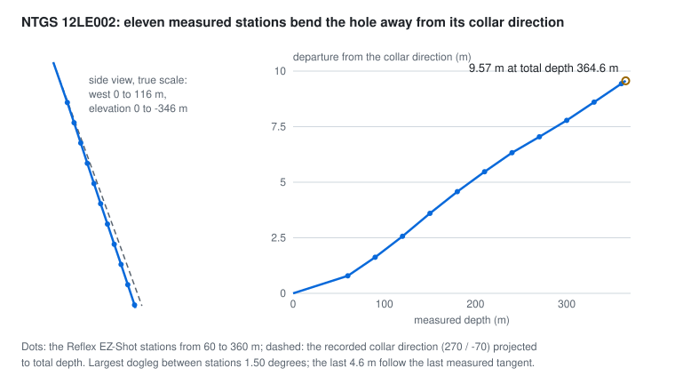

# NTGS 12LE002: one hole with measured surveys

**Source.** Northern Territory Geological Survey compilations DIP043 (collars and surveys) and DIP001 (the assay
member of report CR2012-1131), CC BY 4.0, attribution Northern Territory of Australia (Northern Territory Geological
Survey). The full archives are tens of gigabytes; the research pass read only complete, CRC-checked members and
corroborated the survey against the original company workbook. Sondara bundles the resulting normalized subset for
hole 12LE002 (NTGS 8440823) in `data/sources/ntgs-12le002/`, with its hashes in the sources manifest.

## What the ingest keeps

| Quantity | Count |
|---|---|
| Collar | 1, total depth 364.6 m |
| Survey records | 13: the recorded collar direction at MD 0, 11 Reflex EZ-Shot single-shot measurements from 60 to 360 m, and a terminal record at total depth repeating the last orientation |
| Determinations | 1,892, over 44 analytes and 59 samples |
| Censored results | 850, below detection |
| Numeric, unqualified Cu and Zn | 118, on 56 distinct supports from MD 148.5 to 327.6 m |

## Decisions carried into every result

- **Only the eleven single-shot records are measurements.** The collar direction and the terminal extension are kept
  with their roles and never counted as stations. The trajectory is minimum curvature through the stations; the largest
  dogleg between consecutive stations is 1.5 degrees.
- **The frame is local and anchored.** East, north and up in ground metres from an origin that is exactly the source
  collar (EPSG:28352 X=981950, Y=8277806, compiled Z=182.28 m, recorded with the frame). Azimuths are true-north
  bearings with the 4 degree declination already applied; correcting them again would be wrong. The compiled elevation
  is SRTM-draped and differs from the report's RL by 5.72 m; neither is claimed as a surveyed datum.
- **Censoring is a qualifier.** The source encodes below-detection results as negative limits and `<limit` text; the
  ingest keeps the qualifier and the limit and leaves the value empty, never a negative concentration and never half the
  limit.
- **Repeats and gaps stay.** Three supports carry two sample identities each; 50 unsampled gaps lie inside the sampled
  span. Repeats stay separate determinations in one split group; gaps stay unsampled.

## Preprocessing

The trajectory is minimum curvature through the recorded collar direction at MD 0 and the eleven measured stations,
extended along the last measured tangent from 360 m to total depth; that extension is what the compiled terminal
record repeats.

<picture>
  <source media="(prefers-color-scheme: dark)" srcset="../assets/preprocess-ntgs-trajectory-dark.svg">
  
</picture>

| Result | Value |
|---|---|
| Largest dogleg between consecutive stations | 1.5014466345 degrees, as in the research audit |
| Departure from the straight collar-direction line at MD 364.600006 | 9.565414584 m; the audit reports 9.565414585 m, a difference of about 8e-11 m |
| Supports beyond the last measured station | none; the deepest sample ends at 327.6 m |
| Sampling gaps between distinct supports | 50, from 0.28 to 9.9 m, 169.51 m in total |
| Supports sampled twice | 153 to 154 m, 232.5 to 232.6 m and 327.5 to 327.6 m |
| Analytes censored in every sample | Sb and Se (59 of 59) |

The QA population holds all 59 samples, with repeats in one split group. The estimation population is empty by
rule: one hole cannot form grouped training and test sets.

## What it can and cannot answer

This hole supplies the measured-desurvey, interval-log, censoring and repeat scenarios. One hole cannot support grouped
spatial training or testing, so it is excluded from estimator comparisons by design, with that reason shown.
