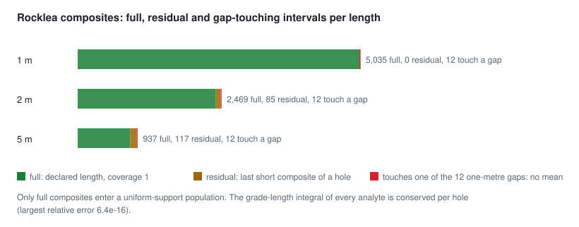

# Rocklea Dome: real multielement assays, assumed-vertical holes

**Source.** CSIRO, Rocklea Dome 3D Mineral Mapping Test Data Set (Rocklea Dome C3DMM), published 2020-06-04,
doi:10.25919/5ed83bf55be6a, CC BY 4.0. The data-description paper is Laukamp, Haest and Cudahy (2021), *Earth System
Science Data* 13, 1371-1386, doi:10.5194/essd-13-1371-2021. The channel iron deposit was drilled with reverse
circulation holes; the paper reports XRF weight percentages of FeO, P, S, SiO2, Al2O3, Mn, CaO, K2O, MgO and TiO2 on
1 m samples by Kalassay Ltd, and loss on ignition at 1000 C.

**Files used.** Three of the collection's 47 files, fetched by their stable CSIRO file IDs and checked by SHA-256
(`data/sources/manifest.json`): the assay workbook `Rocklea_Assay_MMX.xlsx` (1,828,032 bytes), the hyperspectral
export `RC_data_tsgexport.CSV` (1,428,944 bytes), which supplies each hole's coordinates, and the terrain and collar
points `dem_plus_collars.csv` (2,862,387 bytes), which supply elevations.

## What the ingest does, and why

| Step | Count | Rule |
|---|---|---|
| Workbook intervals | 17,474 | 500 hole IDs, original `From`/`To` support, no duplicate or non-positive intervals |
| With a unique source collar | 7,240 | a hole's TSG coordinates match exactly one terrain point within 0.51 m (all 192 mapped holes match within 0.20 m); no interpolation, no invented collars |
| Not zero in every analyte | 5,035 | 2,205 mapped rows are zero in every column: an absent analysis, not a measured zero grade; quarantined |
| Holes | 158 | the other 34 mapped holes have no eligible interval |

The 5,035 intervals are one metre each, in 158 holes (6 to 54 intervals per hole), with positive Fe, SiO2 and Al2O3 on
every row, and complete values for the eleven nonconstant analytes: Fe, P, S, SiO2, Al2O3, Mn, CaO, K2O, MgO, TiO2 and
LOI. The row identities are pinned by a hash, so a change in the source or the rule is caught.

## Decisions carried into every result

- **Trajectories are assumed vertical.** The collection holds no station surveys; a third-party workflow's
  `survey.csv` was authored as vertical. The label `assumed-vertical` travels with every derived interval.
- **The horizontal datum is unresolved.** The terrain raster declares WGS84 / UTM 50S; a third-party notebook uses
  AGD84 / AMG50. The frame is the source's metric grid, declared local, with no EPSG code and no basemap.
- **Maximum assay depth is an observed extent, not a total depth.** Total depth is null.
- **Four columns are dropped from the analytes:** Fe2o3, MnO, Na2O and LOI-100 are zero on the whole eligible
  population. An element and its oxide are not independent information.
- **The iron column is named Fe in the workbook and FeO in the paper.** The values keep the workbook name; the
  difference is an issue, and no conversion is made.
- **The TSG export is a separate source.** Its assay-like columns are not treated as new assays; it contributes
  coordinates only.

## Preprocessing

Each hole is desurveyed by GeoCond as a one-station survey pointing straight down from its collar, so every position
keeps the collar's easting and northing and drops by the measured depth; the output flags every position as an
extension of that assumed direction. The 5,035 intervals then composite per hole, on boundaries anchored at the hole's
first sampled depth:

| Length | Full composites | Residuals | Touching a gap (no mean) |
|---|---:|---:|---:|
| 1 m | 5,035 | 0 | 12 |
| 2 m | 2,469 | 85 | 12 |
| 5 m | 937 | 117 | 12 |

<picture>
  <source media="(prefers-color-scheme: dark)" srcset="../assets/preprocess-rocklea-composites-dark.svg">
  
</picture>

- **The 1 m composites reproduce the native intervals exactly.** Each has one parent with a full metre of overlap and
  the parent's eleven values, which checks the compositing chain end to end.
- **The twelve gaps are single metres** in eleven holes; the composites that touch them keep their numerator and
  valid length and have no mean, so no gap is bridged at any length.
- **Conservation.** The grade-length integral of every analyte is conserved per hole at every length (largest relative
  error 6.4e-16).
- **Populations.** Three uniform-support populations for the grade and multivariable scenarios: the 5,035 native
  intervals, the 2,469 full 2 m composites and the 937 full 5 m composites, each on all 158 holes. Residuals and
  gap-touching composites are counted as excluded, not dropped silently.

## Splits and features

| Scheme | Train | Validation | Calibration | Test | Buffer |
|---|---:|---:|---:|---:|---:|
| hole-group | 95 | 24 | 16 | 23 | |
| spatial-margin | 93 | 23 | 16 | 24 | 2 |

The spatial-margin buffer is 146.8 m (1.5 median collar spacings on the roughly 100 m grid); only two holes lie that
close to a margin hole, since most margin holes are 200 m or more from the rest. On the 1 m population of the
hole-group split, Fe has 2,997 training samples in 95 holes, a mean of 32.50 wt% and a cell-declustered mean of 31.82
wt%. Its downhole variogram rises from about 48 at 1 m to about 260 at 12 m, below the training variance of 323, while
spatial pairs between holes already sit near 210 at the first lag: continuity along a hole is short, and much of the
variance lies between holes. [The precompute page](../architecture/05_precompute-pipeline.md) shows the variograms.

## Models

The covariance selected on the validation holes, for Fe:

| Scheme | Population | Model | Validation RMSE (wt%) |
|---|---|---|---:|
| hole-group | 1 m | nugget 158 + exponential 166, ranges 3,000 m north, 1,862 m east, 62 m vertical | 14.09 |
| hole-group | 2 m | nugget 134 + exponential 160, ranges 2,999 / 1,895 / 66 m | 13.06 |
| hole-group | 5 m | nugget 84 + exponential 170, ranges 2,212 / 2,999 / 82 m | 10.89 |
| spatial-margin | 1 m | nugget 55 + spherical 148 (58 / 102 / 40 m) + spherical 121 (2,981 / 1,857 / 8 m) | 12.27 |
| spatial-margin | 2 m | nugget 51 + spherical 126 (6 / 103 / 41 m) + spherical 105 (2,981 / 1,724 / 9 m) | 11.39 |
| spatial-margin | 5 m | nugget 32 + spherical 92 (103 / 285 / 95 m) + spherical 112 (1,917 / 2,981 / 11 m) | 9.00 |

Every model has one horizontal range at the fitting bound (five times the largest fitted separation), which the
models record: the variograms are flat beyond the first lag of about 50 m, so horizontal continuity is not resolved at
the roughly 100 m drilling grid, and much of the variance between holes appears as nugget. Longer composites lower the
nugget and the validation error, as support averaging predicts. Every method predicts every test sample; universal
kriging needed its declared enlarged neighbourhood for 39 samples of the 1 m and 19 of the 2 m hole-group populations,
where the chosen holes lay in one vertical plane.

## What it can and cannot answer

Rocklea supplies the grade and multivariable scenarios (R01 to R12): whole-hole and spatial-margin holdouts over 158
groups, composite-length changes, directional continuity, Fe with SiO2 and Al2O3 cokriging, and the eleven-feature
autoencoder review. It cannot supply measured survey geometry, a geodetic placement or any observed lithology.
